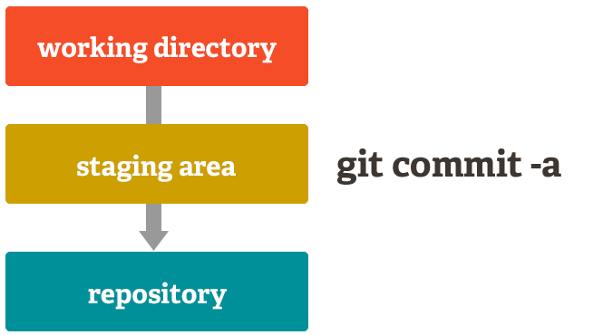

<!-- paginate: true -->
# [Git](https://git-scm.com/ "Git-scm webpage") and [Gerrit](https://www.gerritcodereview.com/ "Gerrit Home Page") usages.
👉 Git is a free and open source distributed version control system (DVCS).
👉 Gerrit is Code Review server with:- 
* [Discuss code](https://www.gerritcodereview.com/index.html#discuss-code-1)
* [Serve Git](https://www.gerritcodereview.com/index.html#serve-git)
* [Manage workflows](https://www.gerritcodereview.com/index.html#manage-workflows)

<!-- _footer: ":information_source: Disclaimer: Further content can be opinionated. 😇" -->

---

### Other major version control system :-
* [Perforce](https://www.perforce.com/) : Proprietary product Helix Core launched in 1995.
* [BitKeeper](https://www.bitkeeper.org/) : Originally proprietary lately open-source under Apache 2.0, was used in Linux kernel development (2002 – April 2005).
* [Apache Subversion](https://subversion.apache.org/) : Client-server model inspired by [CVS](https://en.wikipedia.org/wiki/Concurrent_Versions_System):
* [Mercurial](https://www.mercurial-scm.org/) : Written in Python as Open Source replacement to BitKeeper.
* [GNU Bazaar](https://bazaar.canonical.com/en/) : Bazaar is written in Python and part of the GNU Project.

<!-- _footer: ":information_source: https://en.wikipedia.org/wiki/List_of_version-control_software." -->

---
# Git protocols :-

Git repo can be `cloned` using following protocol:-

* `ssh://[user@]host.xz[:port]/path/to/repo.git/`
* `git://host.xz[:port]/path/to/repo.git/`
* `http[s]://host.xz[:port]/path/to/repo.git/`
* `ftp[s]://host.xz[:port]/path/to/repo.git/`

👉 `https` need user credentials for `write` access to repo.
👉 `git` protocol lack authentication on server side. It is paired with `ssh/https` for `write` access to repo.

<!-- _footer: ":information_source: https://git-scm.com/book/en/v2/Git-on-the-Server-The-Protocols" -->

---

<!-- _header: ":information_source: Git Staging area." -->
<!-- _footer: ":information_source: https://git-scm.com/about/staging-area" -->


---

<!-- _footer: ":information_source: Git Commit flow." -->


* `git status` : Show all `git` tracked file changes along with state of `stage`.
* `git commit -a` : Move all tracked and modified files to `stage area` and `commit`.
* `git add <filename>` : Move particular file from `working area` to  `stage area`.

---

<!-- _header: ":information_source: Git Branching." -->
<!-- _footer: ":information_source: https://git-scm.com/about/branching-and-merging" -->


* `git branch -a` : Show all `git` branches including `remote` and `local`.
* `git branch -r` : Show all `remote` git branches.
* `git checkout -b <branch-name>` : Create new `git branch` from current `git branch` with `branch-name`.

---

<!-- _header: ":information_source: Git Merge." -->
<!-- _footer: ":information_source: https://git-scm.com/docs/git-merge" -->
Assume the following history exists and the current branch is `master`.

```
      A---B---C topic
     /
    D---E---F---G master
```

After `git merge topic` runs successfully.

```
      A---B---C topic
     /         \
    D---E---F---G---H master
```

---

<!-- _header: ":information_source: Git Rebase." -->
<!-- _footer: ":information_source: https://git-scm.com/docs/git-rebase" -->

Assume the following history exists and the current branch is "topic":

```
          A---B---C topic
         /
    D---E---F---G master
```

After running any of following commands :-
`git rebase master`
`git rebase master topic`

```
                  A'--B'--C' topic
                 /
    D---E---F---G master
```

---

<!-- _footer: ":information_source: Gerrit commands." -->
* Same command as pushing to `Git` with one `Gerrit` speciality: The target branch is prefixed with `refs/for/`
`git push origin HEAD:refs/for/<branch-name>`
* Example:
`git push origin HEAD:refs/for/master`same as `git push origin HEAD:refs/for/refs/heads/master`
* Push directly to `Git` (bypassing code review):
`git push origin HEAD:<branch-name>`
* Example:
`git push origin HEAD:master`same as `git push origin HEAD:refs/heads/master`

---

<!-- _header: ":information_source: Opinionated workflow for development." -->

* Clone repo from `gerrit` with `commit-msg-hook`
* Never use `remote`  git `branches` for making local changes.

Example: Create `gerrit` change-list(CL) for `BWVONE-19` from `master`:-
```
git checkout master
git checkout -b BWVONE-19
git pull origin master --rebase
<Do some work and commit changes>
git push -vv ssh://<gerrit-username><repo-path>/<repo-name> HEAD:refs/for/master
```

---

<!-- _header: ":information_source: Git LFS." -->
<!-- _footer: ":information_source: https://git-lfs.github.com" -->

# Git LFS : An open source Git extension for versioning large files.

Install `git-lfs` on machine :-
`brew install git-lfs`

```
git lfs install
git lfs track "*.psd"
git add .gitattributes

git add file.psd
git commit -m "Add design file"
git push origin master
```

---

### References :-

* [Git – Concepts and Workflows](https://docs.google.com/presentation/d/1IQCRPHEIX-qKo7QFxsD3V62yhyGA9_5YsYXFOiBpgkk/edit#slide=id.g4d6b1121f4_0_25)
* [Gerrit - Concepts and Workflows](https://docs.google.com/presentation/d/1C73UgQdzZDw0gzpaEqIC6SPujZJhqamyqO1XOHjH-uk/edit#slide=id.g4d6c16487b_31_60)
* [Git Documentation](https://git-scm.com/doc "Git Documentation")
* [Git External Links](https://git-scm.com/doc/ext)
* [Github Resources to learn Git](https://try.github.io/)
* [Git DevDocs](https://devdocs.io/git/)
* [Google Finds: Centralized Control, Distributed Data Architectures Work Better Than Fully Decentralized Architectures](http://highscalability.com/blog/2014/4/7/google-finds-centralized-control-distributed-data-architectu.html)
